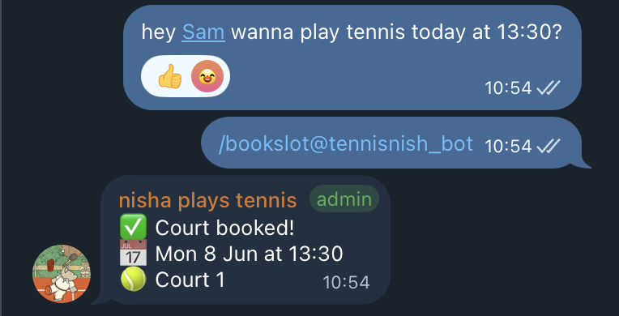
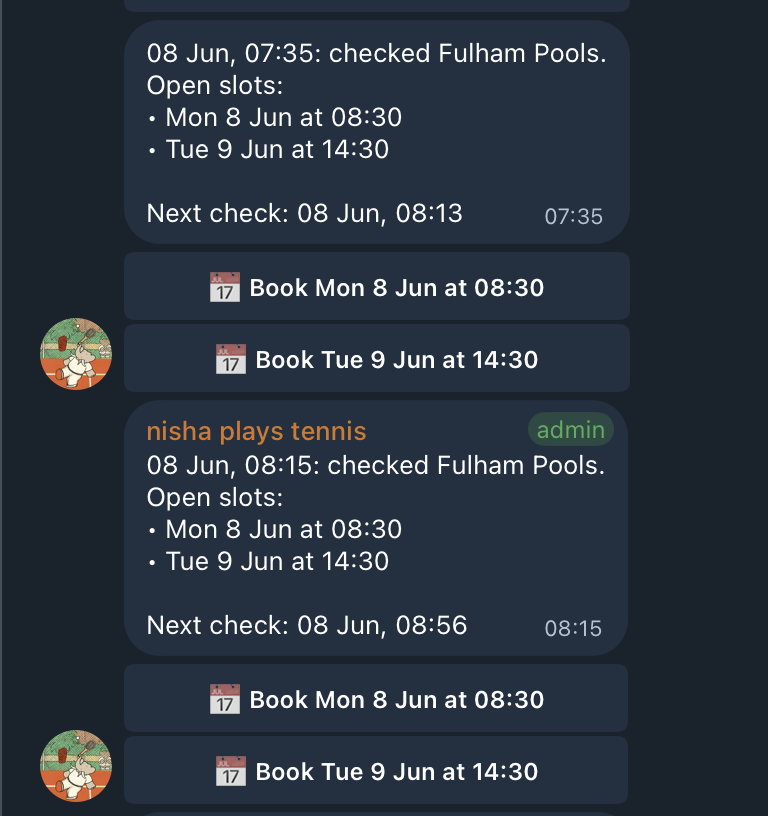
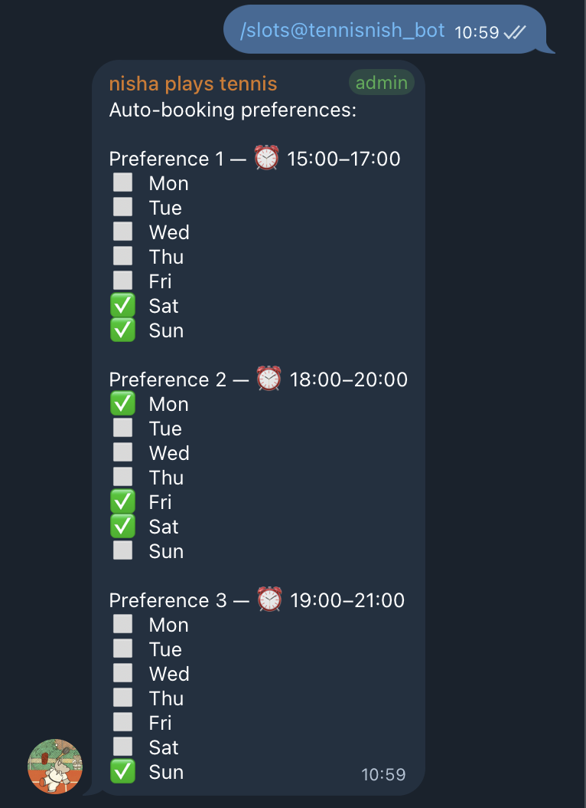

# Virgin Active Court Booker

A personal Telegram bot that books tennis courts at my local Virgin Active gym for me.

## Why

My gym's app is unreliable on poor connections, and popular slots go fast. I built a bot I can message from anywhere to check availability and book a court — no app required.

## How it works

A Cloudflare Worker runs in the background and checks court availability throughout the day. When it finds an open slot that matches my preferences, it books it and lets me know via Telegram.

I can also chat with the bot directly to manage everything:

- `/bookings` — add or remove auto-booking preferences via inline buttons. Select morning, afternoon, or evening (multi-select), pick a time window per period, choose which days, and confirm. Warns on overlaps with existing preferences. Supports multiple active preferences simultaneously.
- `/slots` — view current preferences as a per-slot day grid
- `/log` — history of the last 10 checks that found open slots, including whether any matched a preference and why
- `/next` / `/last` — scheduling info

## Stack

- **Runtime**: Cloudflare Workers (scheduled + fetch handlers)
- **State**: Cloudflare KV (auth token cache, scheduling state, booking preferences)
- **Notifications**: Telegram Bot API with inline keyboards and callback queries
- **API**: Virgin Active private mobile API, reverse-engineered via mitmproxy

## Known Issues

- [x] Auth token refresh and login failures are silent — errors are now surfaced to Telegram once per failure window

## TODO

- [x] FIX: token refreshes and login fails silently — auth errors now surfaced to Telegram once per failure window; login endpoint and request format corrected
- [ ] Support booking group fitness classes (not just courts)
- [ ] Integrate with other platforms for Padel court bookings
- [ ] Support multiple Virgin Active locations via the same API
- [ ] Generate an "Add to Calendar" link when a booking is confirmed
- [ ] Poll group chat members for availability before booking

## Notes

Built for personal use. All credentials are stored as Wrangler secrets and never committed.
